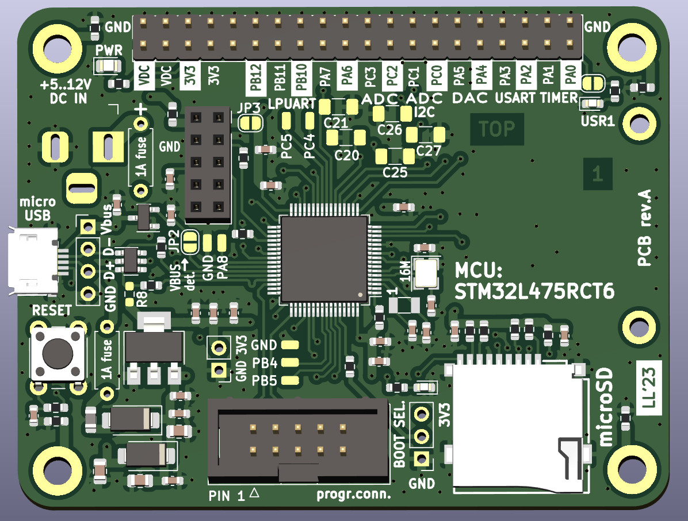

## STM32L475 protoboard

Development board for STM32L475 (4-layer board). Includes header for W5500 Ethernet module (SPI bus).

JP2 solder jumper needs to be short-circuited to enable USB VBUS detection. Solder jumper needs to be short-circuited to enable USR1 LED. 
R8 is NOT to be mounted (USB data line pull-up is not used for this MCU type). Fuse pads for polyswitch fuses. SMD capacitor pads are for A/D LPF (MCU pins have multiple functions).

Connector pinouts are documented on the bottom side of the board (programming interface, SPI interface).

Designed by Lasse OH3HZB 2023

This work is licensed under a [Creative Commons Attribution-NonCommercial 4.0 International License (CC BY-NC 4.0)](https://creativecommons.org/licenses/by-nc/4.0/).

