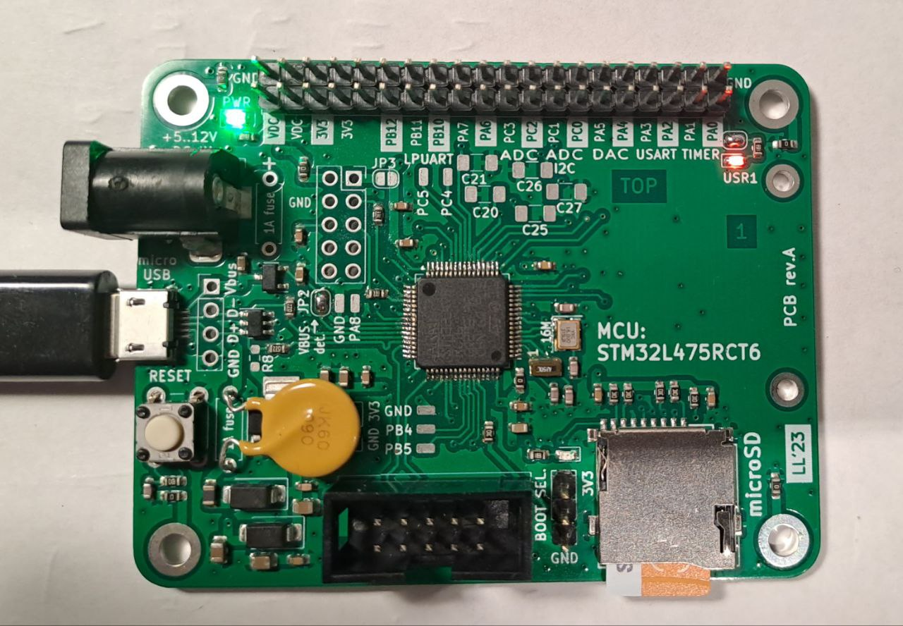

## STM32L475 protoboard

Development board for STM32L475 (4-layer board). Includes header for W5500 Ethernet module (SPI bus).

JP2 solder jumper needs to be short-circuited to enable USB VBUS detection (not needed if powered only from microUSB connector). Solder jumper needs to be short-circuited to enable USR1 LED. R8 is NOT to be mounted (USB data line pull-up is not used for this MCU type). Fuse pads are for polyswitch fuses. SMD capacitor pads are for A/D LPF (MCU pins have multiple functions).

Boot selection pin (BOOT0) next to the programming connector should be in normal operation shorted to GND (jumper). This means booting from FLASH.

Connector pinouts are documented on the bottom side of the board (programming interface, SPI interface).

See also the daughterboard, in the subdirectory "STM32daughter".

Designed by Lasse OH3HZB 2023

This work is licensed under a [Creative Commons Attribution-NonCommercial 4.0 International License (CC BY-NC 4.0)](https://creativecommons.org/licenses/by-nc/4.0/).

### RevA ERRATA

* Silkscreen: BOTTOM silkscreen, Ethernet connector's pin next to 3V3 should be VDC, not "NC". Actual wiring is correct.

### 3D

### Photo

### Schematic

Open with KiCAD (v.7+) or use [this PDF](STM32L475-protoboard.pdf).

